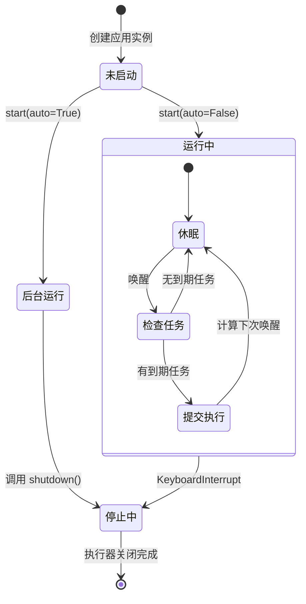
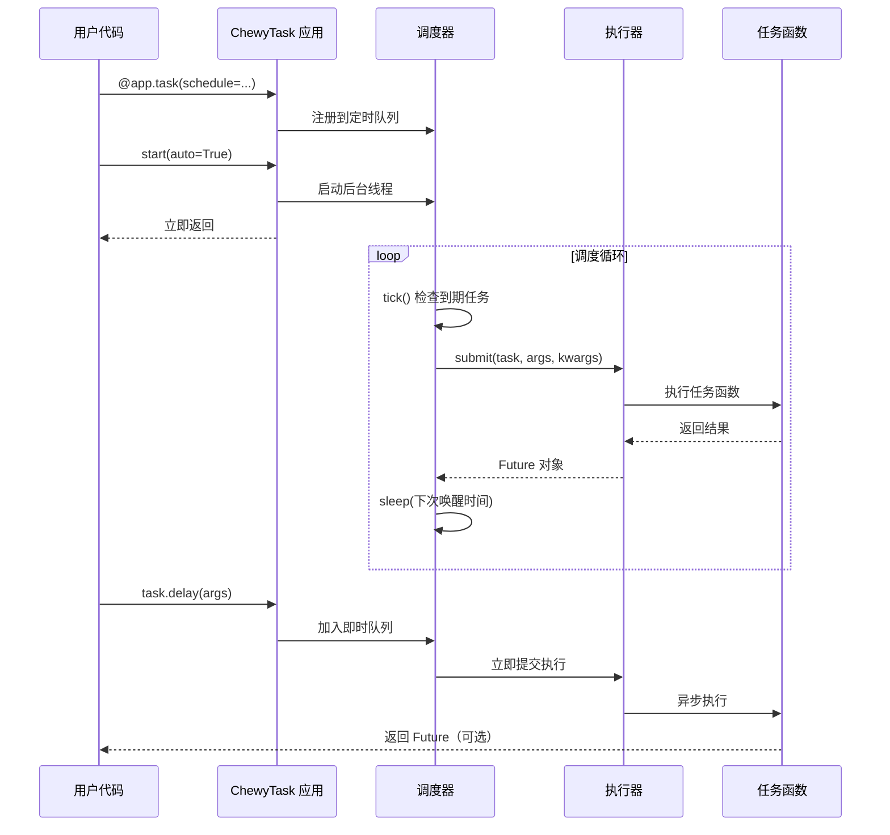

# ChewyTask 第一版定时任务设计文档

## 设计目标

基于现有 Thyme 原型代码，打造一个类 Celery 语法的轻量级单机任务调度系统，融合 APScheduler 的调度灵活性，支持多线程/多进程执行模式。

## 核心特性

### 1. 启动模式增强

系统应支持灵活的启动配置，允许用户根据场景选择同步/异步、线程/进程执行模式。

**启动参数设计**

| 参数名 | 类型 | 默认值 | 说明 |
|--------|------|--------|------|
| auto | bool | False | 是否自动启动调度器（后台模式） |
| threading | bool | True | True 为线程模式，False 为进程模式 |

**启动行为描述**

- 当 `auto=False` 时：调用 `start()` 会阻塞主线程，同步运行调度循环
- 当 `auto=True, threading=True` 时：在后台线程中启动调度器，立即返回
- 当 `auto=True, threading=False` 时：在后台进程中启动调度器，立即返回

### 2. 任务定义语法

#### 2.1 基础任务装饰器

支持无参数装饰器语法，自动注册任务函数。

**装饰器行为**

- 使用 `@app.task()` 或 `@app.task` 均可注册任务
- 任务默认以函数名作为唯一标识
- 不绑定调度规则的任务，仅供 `delay()` 手动触发

#### 2.2 带调度规则的任务

任务可直接通过装饰器参数声明调度规则。

**调度类型支持**

| 调度类型 | 参数形式 | 示例 |
|----------|----------|------|
| 固定间隔 | schedule=IntervalSchedule(interval=秒数) | schedule=IntervalSchedule(interval=5) |

### 3. 延迟执行语法

任务对象应提供 `delay()` 方法，支持异步提交任务到执行队列。

**delay 行为定义**

- 接受任务函数的位置参数和关键字参数
- 将任务加入待执行队列，由调度器或工作池处理
- 立即返回，不阻塞调用线程
- 在线程模式下，通过线程池执行
- 在进程模式下，通过进程池执行

**返回值处理**

- delay() 方法返回任务的异步结果句柄（如 Future 对象或任务 ID）
- 调用方可通过句柄获取任务执行状态和结果

### 4. 独立调度装饰器

提供 `@app.schedule()` 装饰器，专门用于定义定时执行的函数。

**与 task 的差异**

- `@app.task()` 注册的任务可以被手动调用（delay）或定时执行
- `@app.schedule()` 仅用于定时执行，不支持 delay 调用
- schedule 装饰器必须提供调度参数，否则无意义

**参数设计**

| 参数 | 类型 | 必填 | 说明 |
|------|------|------|------|
| schedule | IntervalSchedule | 是 | 调度规则对象 |

### 5. 调度器增强

#### 5.1 任务队列管理

调度器维护两类任务：

1. **定时任务队列**：由 `schedule` 参数或 `@app.schedule()` 注册的任务，按时间规则触发
2. **即时任务队列**：由 `delay()` 提交的任务，先进先出执行

#### 5.2 执行模式切换

**线程模式执行逻辑**

- 使用 ThreadPoolExecutor 管理工作线程
- 定时任务到期后提交到线程池执行
- delay 任务直接提交到同一线程池
- 共享主进程内存空间，数据传递无需序列化

**进程模式执行逻辑**

- 使用 ProcessPoolExecutor 管理工作进程
- 任务参数和结果需要可序列化（pickle）
- 进程间隔离，避免 GIL 限制
- 适合 CPU 密集型任务

#### 5.3 调度循环优化

调度器应智能计算下次唤醒时间，避免空转浪费资源。

**唤醒策略**

- 遍历所有定时任务，找出最近到期的任务
- 计算到期剩余时间作为休眠时长
- 如果有即时任务在队列中，立即唤醒执行
- 默认最大休眠时间不超过 1 秒，保证响应性

### 6. 日志系统

沿用现有日志配置，记录关键事件：

- 调度器启动/停止
- 任务注册信息
- 任务触发和执行时间
- 任务执行异常（需捕获并记录，不应中断调度器）

## 项目结构设计

项目应遵循 Python 包管理最佳实践，使用 uv 作为依赖和环境管理工具。

### 目录结构建议

```
ChewyTask/
├── chewy_task/          # 主包目录
│   ├── __init__.py      # 导出 ChewyTask、Task、IntervalSchedule 等
│   ├── app.py           # ChewyTask 应用主类
│   ├── task.py          # Task、TaskEntry 定义
│   ├── scheduler.py     # Scheduler 调度器
│   └── schedules.py     # IntervalSchedule 等调度规则
├── pyproject.toml       # uv 项目配置
├── README.md
└── examples/            # 使用示例
    └── basic_usage.py
```

### 依赖管理

**必需依赖**

- Python >= 3.8（支持 concurrent.futures 标准库）

**可选依赖**

- 无需外部中间件依赖，所有功能基于标准库实现

## 使用示例

### 示例 1：后台线程模式 + 定时任务

```
描述定时任务场景的使用方式：
1. 创建 ChewyTask 应用实例
2. 使用 @app.task 装饰器注册任务，并通过 schedule 参数绑定间隔调度
3. 调用 app.start(auto=True, threading=True) 启动后台调度
4. 主线程可以继续执行其他逻辑
```

### 示例 2：进程模式 + 手动触发

```
描述手动触发任务的场景：
1. 创建应用实例并启动后台进程调度器（threading=False）
2. 注册任务但不绑定调度规则
3. 在需要时通过 task_func.delay(args) 异步提交任务
4. 进程池自动调度执行
```

### 示例 3：独立调度装饰器

```
描述纯定时任务场景：
1. 使用 @app.schedule(schedule=...) 装饰器定义定时函数
2. 此类函数不支持 delay 调用，仅按计划执行
3. 启动调度器后自动按规则运行
```

### 示例 4：阻塞模式运行

```
描述前台同步运行场景：
1. 注册定时任务
2. 调用 app.start() 不传参数（默认 auto=False）
3. 调度器阻塞主线程运行，直到手动中断（Ctrl+C）
```

## 技术实现要点

### 1. 装饰器设计模式

- 支持带括号和不带括号两种调用形式（通过判断第一个参数是否为 callable 实现）
- 装饰器应返回原函数以保持函数签名，同时附加 `delay` 方法

### 2. Task 对象增强

Task 对象需要具备以下能力：

- 保存原始函数引用
- 附加 delay 方法，接受任意参数
- delay 方法内部调用应用实例的任务提交接口

### 3. 执行器抽象

定义执行器接口，屏蔽线程/进程差异：

**执行器接口行为**

- submit(task, args, kwargs)：提交任务返回 Future 对象
- shutdown()：优雅关闭执行器

**实现类**

- ThreadExecutor：包装 ThreadPoolExecutor
- ProcessExecutor：包装 ProcessPoolExecutor

### 4. 任务队列设计

**定时任务存储**

- 使用字典按任务 ID 索引 TaskEntry
- TaskEntry 包含：任务引用、调度规则、上次运行时间、参数

**即时任务队列**

- 使用线程安全的 Queue 存储 delay 提交的任务
- 调度器每次 tick 检查队列，有任务则立即提交执行器

### 5. 异常处理策略

**任务执行异常**

- 捕获任务函数内部异常，记录日志
- 异常不应导致调度器或执行器崩溃
- 定时任务异常后继续按计划运行

**调度器异常**

- 捕获 KeyboardInterrupt 实现优雅退出
- 其他未预期异常应记录详细栈信息

### 6. 资源清理

**应用关闭时**

- 调用执行器的 shutdown 方法
- 等待正在运行的任务完成（可配置超时时间）
- 清空任务队列

## 配置参数设计

ChewyTask 应用初始化可接受配置参数：

| 参数 | 类型 | 默认值 | 说明 |
|------|------|--------|------|
| max_workers | int | None | 执行器最大工作线程/进程数，None 表示自动选择 |
| task_timeout | float | None | 单个任务最大执行时间（秒），超时则强制终止 |
| logger | Logger | None | 自定义日志对象，None 使用默认日志配置 |

## 数据流图

```mermaid
graph TD
    A[用户代码] -->|@app.task| B[任务注册表]
    A -->|task.delay| C[即时任务队列]
    B -->|带 schedule 参数| D[定时任务队列]
    
    E[调度器主循环] -->|tick 检查到期| D
    E -->|检查队列| C
    
    D -->|提交任务| F[执行器]
    C -->|提交任务| F
    
    F -->|线程模式| G[ThreadPoolExecutor]
    F -->|进程模式| H[ProcessPoolExecutor]
    
    G -->|执行| I[任务函数]
    H -->|执行| I
    
    I -->|返回结果| J[Future 对象]
    J -->|用户获取| A
```

## 状态转换图



## 调度时序图



## 风险与限制

### 1. 进程模式限制

- 任务函数及其参数必须可序列化（pickle）
- Windows 系统需要在 `if __name__ == '__main__'` 保护下启动
- 进程间通信开销大于线程模式

### 2. GIL 影响

- 线程模式受 Python GIL 限制，CPU 密集型任务无法真正并行
- 建议 I/O 密集型任务使用线程模式，CPU 密集型使用进程模式

### 3. 调度精度

- 基于轮询检查，最小调度精度约 100ms
- 长耗时任务可能延迟后续任务触发
- 不适合需要毫秒级精度的场景

### 4. 资源隔离

- 线程模式下任务共享全局状态，需注意线程安全
- 进程模式下任务隔离，但内存占用更高

## 扩展性考虑

为后续版本预留扩展点：

1. **更多调度类型**：支持 Cron 表达式、每日定时、自定义调度规则
2. **任务依赖**：支持任务链、分组执行
3. **结果持久化**：可选将任务执行结果存储到文件或数据库
4. **监控接口**：提供任务执行统计、健康检查 API
5. **优先级队列**：delay 任务支持优先级参数
6. **任务重试**：失败任务自动重试机制

## 版本规划

**第一版功能范围**

- ✓ 基础任务装饰器（@app.task）
- ✓ 固定间隔调度（IntervalSchedule）
- ✓ 延迟执行（task.delay）
- ✓ 线程/进程模式切换
- ✓ 自动/手动启动
- ✓ 独立调度装饰器（@app.schedule）

**后续版本规划**

- Cron 调度支持
- 任务结果查询
- 更丰富的配置选项
- Web 管理界面

任务对象应提供 `delay()` 方法，支持异步提交任务到执行队列。

**delay 行为定义**

- 接受任务函数的位置参数和关键字参数
- 将任务加入待执行队列，由调度器或工作池处理
- 立即返回，不阻塞调用线程
- 在线程模式下，通过线程池执行
- 在进程模式下，通过进程池执行

**返回值处理**

- delay() 方法返回任务的异步结果句柄（如 Future 对象或任务 ID）
- 调用方可通过句柄获取任务执行状态和结果

### 4. 独立调度装饰器

提供 `@app.schedule()` 装饰器，专门用于定义定时执行的函数。

**与 task 的差异**

- `@app.task()` 注册的任务可以被手动调用（delay）或定时执行
- `@app.schedule()` 仅用于定时执行，不支持 delay 调用
- schedule 装饰器必须提供调度参数，否则无意义

**参数设计**

| 参数 | 类型 | 必填 | 说明 |
|------|------|------|------|
| schedule | IntervalSchedule | 是 | 调度规则对象 |

### 5. 调度器增强

#### 5.1 任务队列管理

调度器维护两类任务：

1. **定时任务队列**：由 `schedule` 参数或 `@app.schedule()` 注册的任务，按时间规则触发
2. **即时任务队列**：由 `delay()` 提交的任务，先进先出执行

#### 5.2 执行模式切换

**线程模式执行逻辑**

- 使用 ThreadPoolExecutor 管理工作线程
- 定时任务到期后提交到线程池执行
- delay 任务直接提交到同一线程池
- 共享主进程内存空间，数据传递无需序列化

**进程模式执行逻辑**

- 使用 ProcessPoolExecutor 管理工作进程
- 任务参数和结果需要可序列化（pickle）
- 进程间隔离，避免 GIL 限制
- 适合 CPU 密集型任务

#### 5.3 调度循环优化

调度器应智能计算下次唤醒时间，避免空转浪费资源。

**唤醒策略**

- 遍历所有定时任务，找出最近到期的任务
- 计算到期剩余时间作为休眠时长
- 如果有即时任务在队列中，立即唤醒执行
- 默认最大休眠时间不超过 1 秒，保证响应性

### 6. 日志系统

沿用现有日志配置，记录关键事件：

- 调度器启动/停止
- 任务注册信息
- 任务触发和执行时间
- 任务执行异常（需捕获并记录，不应中断调度器）

## 项目结构设计

项目应遵循 Python 包管理最佳实践，使用 uv 作为依赖和环境管理工具。

### 目录结构建议

```
ChewyTask/
├── chewy_task/          # 主包目录
│   ├── __init__.py      # 导出 ChewyTask、Task、IntervalSchedule 等
│   ├── app.py           # ChewyTask 应用主类
│   ├── task.py          # Task、TaskEntry 定义
│   ├── scheduler.py     # Scheduler 调度器
│   └── schedules.py     # IntervalSchedule 等调度规则
├── pyproject.toml       # uv 项目配置
├── README.md
└── examples/            # 使用示例
    └── basic_usage.py
```

### 依赖管理

**必需依赖**

- Python >= 3.8（支持 concurrent.futures 标准库）

**可选依赖**

- 无需外部中间件依赖，所有功能基于标准库实现

## 使用示例

### 示例 1：后台线程模式 + 定时任务

```
描述定时任务场景的使用方式：
1. 创建 ChewyTask 应用实例
2. 使用 @app.task 装饰器注册任务，并通过 schedule 参数绑定间隔调度
3. 调用 app.start(auto=True, threading=True) 启动后台调度
4. 主线程可以继续执行其他逻辑
```

### 示例 2：进程模式 + 手动触发

```
描述手动触发任务的场景：
1. 创建应用实例并启动后台进程调度器（threading=False）
2. 注册任务但不绑定调度规则
3. 在需要时通过 task_func.delay(args) 异步提交任务
4. 进程池自动调度执行
```

### 示例 3：独立调度装饰器

```
描述纯定时任务场景：
1. 使用 @app.schedule(schedule=...) 装饰器定义定时函数
2. 此类函数不支持 delay 调用，仅按计划执行
3. 启动调度器后自动按规则运行
```

### 示例 4：阻塞模式运行

```
描述前台同步运行场景：
1. 注册定时任务
2. 调用 app.start() 不传参数（默认 auto=False）
3. 调度器阻塞主线程运行，直到手动中断（Ctrl+C）
```

## 技术实现要点

### 1. 装饰器设计模式

- 支持带括号和不带括号两种调用形式（通过判断第一个参数是否为 callable 实现）
- 装饰器应返回原函数以保持函数签名，同时附加 `delay` 方法

### 2. Task 对象增强

Task 对象需要具备以下能力：

- 保存原始函数引用
- 附加 delay 方法，接受任意参数
- delay 方法内部调用应用实例的任务提交接口

### 3. 执行器抽象

定义执行器接口，屏蔽线程/进程差异：

**执行器接口行为**

- submit(task, args, kwargs)：提交任务返回 Future 对象
- shutdown()：优雅关闭执行器

**实现类**

- ThreadExecutor：包装 ThreadPoolExecutor
- ProcessExecutor：包装 ProcessPoolExecutor

### 4. 任务队列设计

**定时任务存储**

- 使用字典按任务 ID 索引 TaskEntry
- TaskEntry 包含：任务引用、调度规则、上次运行时间、参数

**即时任务队列**

- 使用线程安全的 Queue 存储 delay 提交的任务
- 调度器每次 tick 检查队列，有任务则立即提交执行器

### 5. 异常处理策略

**任务执行异常**

- 捕获任务函数内部异常，记录日志
- 异常不应导致调度器或执行器崩溃
- 定时任务异常后继续按计划运行

**调度器异常**

- 捕获 KeyboardInterrupt 实现优雅退出
- 其他未预期异常应记录详细栈信息

### 6. 资源清理

**应用关闭时**

- 调用执行器的 shutdown 方法
- 等待正在运行的任务完成（可配置超时时间）
- 清空任务队列

## 配置参数设计

ChewyTask 应用初始化可接受配置参数：

| 参数 | 类型 | 默认值 | 说明 |
|------|------|--------|------|
| max_workers | int | None | 执行器最大工作线程/进程数，None 表示自动选择 |
| task_timeout | float | None | 单个任务最大执行时间（秒），超时则强制终止 |
| logger | Logger | None | 自定义日志对象，None 使用默认日志配置 |

## 数据流图

```mermaid
graph TD
    A[用户代码] -->|@app.task| B[任务注册表]
    A -->|task.delay| C[即时任务队列]
    B -->|带 schedule 参数| D[定时任务队列]
    
    E[调度器主循环] -->|tick 检查到期| D
    E -->|检查队列| C
    
    D -->|提交任务| F[执行器]
    C -->|提交任务| F
    
    F -->|线程模式| G[ThreadPoolExecutor]
    F -->|进程模式| H[ProcessPoolExecutor]
    
    G -->|执行| I[任务函数]
    H -->|执行| I
    
    I -->|返回结果| J[Future 对象]
    J -->|用户获取| A
```

## 状态转换图


## 调度时序图


## 风险与限制

### 1. 进程模式限制

- 任务函数及其参数必须可序列化（pickle）
- Windows 系统需要在 `if __name__ == '__main__'` 保护下启动
- 进程间通信开销大于线程模式

### 2. GIL 影响

- 线程模式受 Python GIL 限制，CPU 密集型任务无法真正并行
- 建议 I/O 密集型任务使用线程模式，CPU 密集型使用进程模式

### 3. 调度精度

- 基于轮询检查，最小调度精度约 100ms
- 长耗时任务可能延迟后续任务触发
- 不适合需要毫秒级精度的场景

### 4. 资源隔离

- 线程模式下任务共享全局状态，需注意线程安全
- 进程模式下任务隔离，但内存占用更高

## 扩展性考虑

为后续版本预留扩展点：

1. **更多调度类型**：支持 Cron 表达式、每日定时、自定义调度规则
2. **任务依赖**：支持任务链、分组执行
3. **结果持久化**：可选将任务执行结果存储到文件或数据库
4. **监控接口**：提供任务执行统计、健康检查 API
5. **优先级队列**：delay 任务支持优先级参数
6. **任务重试**：失败任务自动重试机制

## 版本规划

**第一版功能范围**

- ✓ 基础任务装饰器（@app.task）
- ✓ 固定间隔调度（IntervalSchedule）
- ✓ 延迟执行（task.delay）
- ✓ 线程/进程模式切换
- ✓ 自动/手动启动
- ✓ 独立调度装饰器（@app.schedule）

**后续版本规划**

- Cron 调度支持
- 任务结果查询
- 更丰富的配置选项
- Web 管理界面
